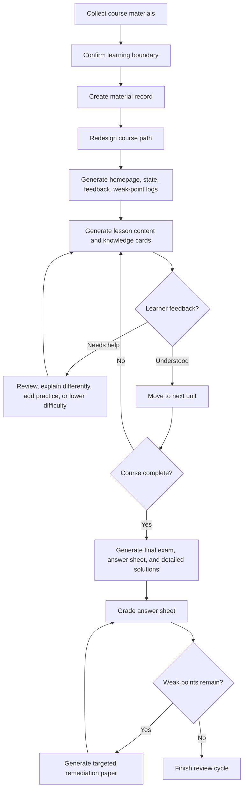

# ko-lesson

> Turn course materials into an Obsidian-ready learning system, not just another pile of notes.

[](LICENSE)
[](SKILL.md)
[](SKILL.md)

`ko-lesson` is a Codex skill for generating structured course-learning and final-review materials from real course files. It reads the materials you provide, defines the learning boundary, rebuilds the course path from easy to hard, creates Obsidian-friendly Markdown files, and maintains a feedback loop that keeps adjusting lessons, exercises, exam papers, corrections, and remediation drills.

It is built for students who do not want a static summary. It creates a learning workspace that remembers progress, records weak points, links knowledge cards, supports bilingual materials, and turns final exam preparation into a traceable cycle.

## Why ko-lesson

Most AI study workflows stop at "summarize this PDF". That is rarely enough for a real course.

`ko-lesson` is designed around a stronger contract:

- Start from the actual course boundary, not generic internet knowledge.
- Rebuild the learning route instead of copying the original chapter order.
- Generate Obsidian-compatible notes with stable double links.
- Explain concepts through intuition, formal definitions, examples, practice, and feedback.
- Track learner background, weak points, progress, and transferable knowledge across courses.
- Produce final exams, answer sheets, detailed solutions, grading records, and targeted remediation papers.
- Separate source-backed content from AI-supplemented explanations.

## Features

### Course Material Mapping

`ko-lesson` first creates `课程材料记录.md`, a source inventory that records what files are included, what each file contains, and how each file will be used in the course.

This prevents a common failure mode: generating polished notes that silently ignore half of the material.

### Learning Path Redesign

The skill generates `课程脉络.md` with a rebuilt learning order:

- foundational concepts first
- medium-difficulty core topics next
- advanced topics, cases, projects, and open questions later
- every unit tagged with difficulty, prerequisites, source files, and knowledge points

The goal is to make the course learnable, not merely mirror the textbook.

### Obsidian-Ready Output

Generated Markdown is designed for Obsidian:

- stable `[[double links]]`
- course files that reference each other
- knowledge cards in `知识点/`
- media files in `媒体库/`
- callouts for questions, examples, tasks, and feedback
- file names that match link names

### Feedback-Driven Learning

By default, `ko-lesson` runs in progressive learning mode:

1. Build the course map and first lesson.
2. Wait for learner feedback.
3. Update learning state, weak points, and background information.
4. Decide whether to continue, review, explain differently, add practice, reduce difficulty, or reorder the path.

This makes the output useful for sustained learning rather than one-shot generation.

### Full Review Mode

When explicitly requested, `ko-lesson` can generate a full set of course files in one pass, including:

- course homepage
- material record
- learning path
- learning state
- feedback log
- weak-point and error log
- lesson files
- knowledge cards
- bilingual terminology and translation notes
- media index
- final exam
- answer sheet
- detailed solutions
- grading record
- targeted remediation papers

### Final Exam Closed Loop

After the last unit is completed, the skill can generate:

- `期末考试.md`
- `期末考试-答题卡.md`
- `期末考试-详细答案.md`

After the learner fills in the answer sheet, it can grade the submission and create:

- `期末考试-批改记录.md`
- `期末考试-巩固卷-第2套.md`
- `期末考试-巩固卷-第2套-答题卡.md`
- `期末考试-巩固卷-第2套-批改记录.md`

If mistakes remain, the remediation loop continues with the next numbered set. Remediation papers focus only on weak or uncertain knowledge points instead of mechanically repeating the entire exam.

### Bilingual and Cross-Disciplinary Support

For English materials, technical terms, formulas, code, papers, or business cases, the skill requires three-layer translation:

- literal translation
- understanding-oriented translation
- plain-language explanation

It also explains cross-disciplinary concepts without assuming that the learner already knows the background vocabulary of a single field.

## Installation

Clone this repository into your Codex skills directory.

### Windows

```powershell
git clone https://github.com/Liunian06/ko-lesson.git "$env:USERPROFILE\.codex\skills\ko-lesson"
```

### macOS / Linux

```bash
git clone https://github.com/Liunian06/ko-lesson.git ~/.codex/skills/ko-lesson
```

Then restart Codex so the skill can be discovered.

## Quick Start

Put your course materials in a project folder, then ask Codex to use `ko-lesson`.

### Progressive Learning

Use this when you want to learn step by step and adjust based on feedback.

```text
使用 ko-lesson，基于 学习材料/财务会计 生成课程学习资料。先生成课程脉络、课程首页、学习状态和第一课，输出到 学习历史/。
```

### Full Final Review

Use this when the exam is close and you need a complete review package immediately.

```text
使用 ko-lesson，基于 学习材料/市场营销基础 一次性生成完整期末复习资料，输出到 学习历史/。
```

### Continue From Feedback

After learning one lesson, give feedback in the generated format.

```text
我能复述的内容：
我卡住的地方：
当前难度评分，1 到 5：
我希望下一步：
这个知识点让我联想到的已学内容：
```

Codex should then update the learning state, feedback record, weak-point log, knowledge cards, and learner background before deciding the next step.

## Generated Structure

A typical output looks like this:

```text
学习历史/
├─ 学习者背景信息.md
└─ 课程名称-YYYYMMDDHHMM/
   ├─ 课程首页.md
   ├─ 课程材料记录.md
   ├─ 课程脉络.md
   ├─ 学习状态.md
   ├─ 学习反馈记录.md
   ├─ 卡点与错因记录.md
   ├─ 中英术语与翻译.md
   ├─ 第01课-学习单元名称.md
   ├─ 第02课-学习单元名称.md
   ├─ 期末考试.md
   ├─ 期末考试-答题卡.md
   ├─ 期末考试-详细答案.md
   ├─ 期末考试-批改记录.md
   ├─ 知识点/
   │  └─ 知识点名称.md
   └─ 媒体库/
      ├─ 媒体库索引.md
      └─ 第01课-知识点名称-用途.png
```

## Core Workflow



## Design Principles

### Source First

Content from course materials must be cited in `来源依据`. AI-generated analogies, exercises, explanations, and examples must be marked as AI supplements.

### Learnable Before Complete

The default mode does not generate every lesson immediately. It creates the course map and first lesson, then waits for feedback so the next lesson can match the learner's actual understanding.

### Obsidian as the Learning Surface

The skill treats Markdown files as a durable learning workspace. Links, callouts, media references, knowledge cards, and progress files are part of the system, not decoration.

### Exams as Diagnosis

Final exams are not only for scoring. They detect weak points, update records, and trigger targeted remediation until the learner can handle the missing knowledge.

## When to Use

Use `ko-lesson` when you have:

- university course materials
- slides, notes, PDFs, transcripts, assignments, or code
- Chinese and English mixed materials
- a final exam or review deadline
- a need for Obsidian-ready learning files
- a desire to learn over multiple sessions with feedback

It is especially useful when a course is broad, messy, bilingual, interdisciplinary, or too dense to review by simple summarization.

## When Not to Use

`ko-lesson` is not ideal when you only need:

- a one-paragraph summary
- a translation of a single page
- a flashcard deck without source tracking
- generic study advice unrelated to course files
- an answer-only solution without learning process

## Repository Contents

```text
.
├─ SKILL.md
├─ LICENSE
└─ README.md
```

`SKILL.md` is the actual Codex skill definition. The README explains what it does and how to use it.

## Development

This repository has no build step. To improve the skill:

1. Edit `SKILL.md`.
2. Keep instructions specific, testable, and source-aware.
3. Avoid adding requirements that cannot be verified from local files.
4. Test with a small course folder before using it on a full course.
5. Confirm generated outputs keep Obsidian links, source attribution, and feedback files consistent.

## Roadmap

- Add example course fixtures.
- Add validation scripts for generated course packages.
- Add template snapshots for common course types.
- Add bilingual sample output.
- Add a compact quick-reference guide for final review mode.

## Contributing

Issues and pull requests are welcome.

Good contributions are concrete:

- clarify an instruction that could be misread
- add a missing output validation rule
- improve the final exam remediation loop
- strengthen source attribution
- improve Obsidian compatibility
- add examples that make the skill easier to test

Please avoid changes that make the skill more generic at the cost of traceability. The core promise is structured, source-aware, feedback-driven learning.

## License

MIT License. See [LICENSE](LICENSE).
