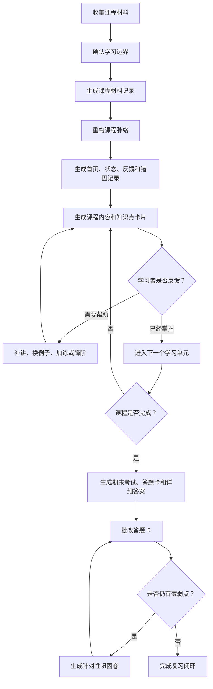

# ko-lesson

> 把课程材料变成可持续学习、可反馈、可复习、可沉淀的 Obsidian 学习系统。

`ko-lesson` 是一个面向课程学习和期末复习的 Codex 技能。它基于真实课程材料工作：先确认学习边界，再重建由浅入深的课程脉络，生成适合 Obsidian 使用的 Markdown 学习资料，并通过反馈、批改、错因记录和巩固卷持续调整学习路径。

它不是“总结一下课件”的提示词，而是一套课程学习资料生成规范。目标是让学习者拿到一个能继续使用的学习工作区：有课程入口、有知识点卡片、有学习状态、有卡点记录、有期末考试、有答题卡、有详细答案，也有针对薄弱点反复巩固的闭环。

## 一句话安装提示词

把下面这句话复制给你的 AI 助手，即可让它帮你下载并安装这个技能：

```text
你需要帮我下载这个 skill：https://github.com/Liunian06/ko-lesson，然后帮我安装这个 skill。
```

## 使用说明

```text
调用 ko-lesson 这个skill，阅读{你的课程材料的路径}下面的材料，在{你的目标输出路径}中一次性生成完整学习资料。
```

[](LICENSE)
[](SKILL.md)
[](SKILL.md)

## Star 增长图

[](https://star-history.com/#Liunian06/ko-lesson&Date)

## 为什么需要 ko-lesson

很多 AI 学习流程停在“帮我总结这个 PDF”。这对真实课程通常不够。

`ko-lesson` 关注的是完整学习过程：

- 从真实材料出发，不凭空扩写成泛泛课程。
- 先建立材料清单，明确哪些文件被纳入学习范围。
- 重建学习顺序，而不是机械照搬课件章节。
- 用 Obsidian 双链组织课程文件、知识点、媒体和反馈记录。
- 同步维护学习状态、卡点错因、掌握度和学习者背景。
- 支持中英双语材料、跨学科内容、代码、公式、案例和实验步骤。
- 在期末复习阶段生成考试、答题卡、详细答案、批改记录和巩固卷。
- 明确区分材料来源内容和 AI 补充解释，避免把补充内容伪装成原文。

## 核心能力

### 课程材料记录

`ko-lesson` 会先生成 `课程材料记录.md`，记录本次学习覆盖哪些文件、每个文件包含什么内容、在课程中承担什么作用，以及哪些内容明确不纳入本次学习。

这一步用于避免一个常见问题：资料看起来很完整，但实际漏掉了关键文件。

### 学习路线重构

技能会生成 `课程脉络.md`，重新设计学习顺序：

- 先安排基础概念、背景知识、核心术语和必要前置知识。
- 再安排主线知识、典型案例、常见任务和基础练习。
- 最后安排高难度主题、复杂案例、综合项目和开放问题。
- 每个学习单元都标注难度、知识点、来源文件、前置要求和排序理由。

目标不是复刻教材目录，而是把课程改造成更容易学会的路径。

### Obsidian 友好输出

生成的 Markdown 文件会尽量适配 Obsidian：

- 稳定的 `[[双链引用]]`
- 课程文件之间互相链接
- 核心知识点放入 `知识点/`
- 图片、截图、图表和示意图放入 `媒体库/`
- 使用提示块承载问题、示例、任务和反馈入口
- 文件名和双链名称保持一致，减少链接失效

### 逐课反馈模式

默认情况下，`ko-lesson` 使用逐课反馈模式：

1. 生成课程脉络、课程首页、学习状态、反馈记录、卡点错因记录和第一课。
2. 等待学习者学习第一课并反馈。
3. 根据反馈更新学习状态、掌握度、错因记录和学习者背景。
4. 决定下一步是继续、补讲、换例子、加练、降阶，还是调整学习顺序。

这个模式适合长期学习，因为后续内容会根据真实反馈调整，而不是一次性堆完所有章节。

### 全量期末复习模式

当用户明确要求“一次性生成全部课程内容”或“全量生成所有课程文件”时，`ko-lesson` 可以一次性生成完整复习包，包括：

- 课程首页
- 课程材料记录
- 课程脉络
- 学习状态
- 学习反馈记录
- 卡点与错因记录
- 课程内容文件
- 知识点卡片
- 中英术语与翻译
- 媒体库索引
- 期末考试
- 期末考试答题卡
- 期末考试详细答案
- 期末考试批改记录
- 针对薄弱点的巩固卷

即使使用全量模式，每一课也会保留反馈入口，后续仍可继续根据反馈调整。

### 期末考试闭环

当课程最后一节完成并通过反馈确认后，技能会生成：

- `期末考试.md`
- `期末考试-答题卡.md`
- `期末考试-详细答案.md`

学习者填写答题卡后，技能会批改并生成：

- `期末考试-批改记录.md`
- `期末考试-巩固卷-第2套.md`
- `期末考试-巩固卷-第2套-答题卡.md`
- `期末考试-巩固卷-第2套-批改记录.md`

如果仍有错误、部分正确或不确定知识点，就继续生成下一套巩固卷。巩固卷只针对薄弱点，不机械重复整套期末考试。

### 双语与跨学科处理

如果课程材料包含英文内容、代码、公式、论文、商业案例或实验步骤，`ko-lesson` 会要求同步生成：

- 原文翻译
- 理解型翻译
- 白话式翻译
- 术语解释
- 使用场景
- 可操作拆解
- 验证方法

对于跨学科内容，技能不会默认学习者已经熟悉某个领域的黑话，而是会补足必要背景、说明领域差异，并帮助学习者建立可迁移的理解。

## 安装

把本仓库克隆到 Codex 技能目录。

### Windows

```
git clone https://github.com/Liunian06/ko-lesson.git "$env:USERPROFILE\.codex\skills\ko-lesson"
```

### macOS / Linux

```
git clone https://github.com/Liunian06/ko-lesson.git ~/.codex/skills/ko-lesson
```

然后重启 Codex，让新的技能被加载。

## 快速开始

把课程材料放到一个项目目录中，然后让 Codex 使用 `ko-lesson`。

### 逐课学习

适合边学边调整、希望根据反馈逐步生成后续课程内容的场景。

```
使用 ko-lesson，基于 学习材料/财务会计 生成课程学习资料。先生成课程脉络、课程首页、学习状态和第一课，输出到 学习历史/。
```

### 期末全量复习

适合考试临近，需要一次性得到完整复习资料的场景。

```
使用 ko-lesson，基于 学习材料/市场营销基础 一次性生成完整期末复习资料，输出到 学习历史/。
```

### 根据反馈继续学习

学习完某一课后，可以按生成文件中的反馈入口填写：

```
我能复述的内容：
我卡住的地方：
当前难度评分，1 到 5：
我希望下一步：
这个知识点让我联想到的已学内容：
```

Codex 应该先更新学习状态、反馈记录、卡点错因记录、知识点卡片和学习者背景，再决定下一步生成什么内容。

## 输出结构

典型输出结构如下：

```
学习历史/
├─ 学习者背景信息.md
└─ 课程名称-YYYYMMDDHHMM/
   ├─ 课程首页.md
   ├─ 课程材料记录.md
   ├─ 课程脉络.md
   ├─ 学习状态.md
   ├─ 学习反馈记录.md
   ├─ 卡点与错因记录.md
   ├─ 中英术语与翻译.md
   ├─ 第01课-学习单元名称.md
   ├─ 第02课-学习单元名称.md
   ├─ 期末考试.md
   ├─ 期末考试-答题卡.md
   ├─ 期末考试-详细答案.md
   ├─ 期末考试-批改记录.md
   ├─ 知识点/
   │  └─ 知识点名称.md
   └─ 媒体库/
      ├─ 媒体库索引.md
      └─ 第01课-知识点名称-用途.png
```

## 工作流



## 设计原则

### 来源优先

来自课程材料的内容必须在 `来源依据` 中标明来源文件、来源位置和使用方式。AI 生成的类比、练习、应用场景和补充解释必须标注为 `AI补充`。

### 先可学，再完整

默认模式不会一次性机械生成所有章节，而是先生成课程地图和第一课，再根据学习者反馈决定后续内容。这样可以避免资料很完整但学习者实际用不起来。

### Obsidian 是学习界面

`ko-lesson` 把 Markdown 文件当作长期学习空间，而不是一次性导出的文本。双链、提示块、媒体库、知识点卡片和进度文件都是学习系统的一部分。

### 考试用于诊断

期末考试不只是打分工具。它用于发现薄弱点、更新记录、生成巩固卷，并推动学习者把错误知识点修复到可以做题和应用的程度。

## 适合使用的场景

适合在以下场景使用 `ko-lesson`：

- 有大学课程材料需要系统复习。
- 有课件、笔记、PDF、转写稿、作业、代码或案例。
- 材料同时包含中文和英文。
- 期末考试临近，需要完整复习包。
- 希望生成 Obsidian 可长期使用的学习资料。
- 希望学习过程能根据反馈持续调整。

尤其适合材料庞杂、章节顺序不适合自学、跨学科内容多、英文术语多、考试范围宽的课程。

## 不适合使用的场景

不建议在以下场景使用 `ko-lesson`：

- 只需要一句话总结。
- 只需要翻译单页内容。
- 只想生成没有来源追踪的抽认卡。
- 只需要泛泛学习建议，不基于课程文件。
- 只要答案，不需要学习过程、错因记录或巩固闭环。

## 仓库内容

```
.
├─ SKILL.md
├─ LICENSE
└─ README.md
```

`SKILL.md` 是实际的 Codex 技能定义；`README.md` 用于说明项目定位、安装方式、使用方式和设计原则。

## 开发

本仓库没有构建步骤。改进技能时建议遵守以下原则：

1. 编辑 `SKILL.md`。
2. 指令要具体、可验证、能从本地材料追溯。
3. 不要加入无法验证的生成承诺。
4. 先用小型课程目录测试，再用于完整课程。
5. 检查生成结果是否保持 Obsidian 链接、来源依据、反馈文件和错因记录一致。

## 路线图

- 增加示例课程材料。
- 增加课程包结构校验脚本。
- 增加常见课程类型的模板快照。
- 增加中英双语样例输出。
- 增加期末全量复习模式的速查说明。

## 贡献

欢迎提交议题和合并请求。

适合的贡献包括：

- 澄清容易误读的技能指令。
- 补充缺失的输出校验规则。
- 改进期末考试与巩固卷闭环。
- 强化来源依据和 AI 补充标注。
- 改善 Obsidian 兼容性。
- 添加更容易测试的示例材料和示例输出。

请避免把技能改得过于泛化，导致来源追踪和反馈闭环变弱。这个项目的核心承诺是：基于真实材料，生成结构化、可反馈、可复习、可持续沉淀的学习系统。

## 许可证

本项目使用 MIT 许可证。详情见 [LICENSE](LICENSE)。
